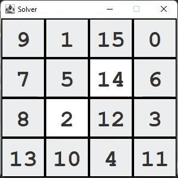
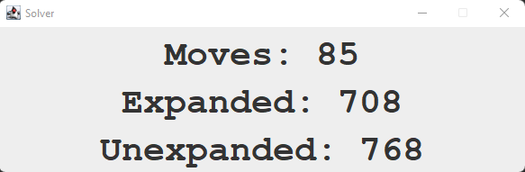

# N Puzzle Solver

## Description
Solves any 3x3 or 4x4 puzzle in a decent amount of time. It can also solve some 5x5 boards, but it can take a very long time.
A* search is used for looking for the best solution. There are 3 methods that can be selected for calculating the heuristics:
- Hamming
- Manhattan
- Linear Search

To change the cost calculation method it has to be modified in the main method of the Solver class.
To change the board size and board numbers, open "board.txt" inside the src folder and modify the first line accordingly:
- In between the parenthesis enter the size. E.g. (3) for 3x3 boards.
- In between the square brackets enter the elements of the board.

## Visual representation
Solver for 4x4 board:

Details after solving:

